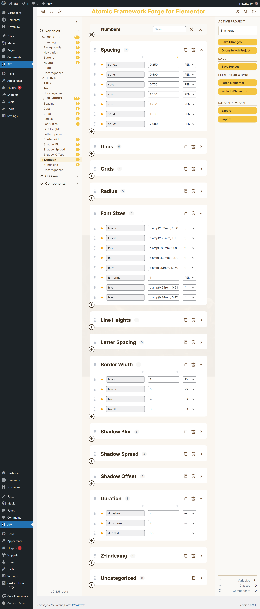

# Atomic Framework Forge for Elementor

**A professional management interface for Elementor Version 4 CSS assets.**

[](https://github.com/Mij-Strebor/atomic-framework-forge-for-elementor/releases)
[](https://github.com/Mij-Strebor/atomic-framework-forge-for-elementor/releases)
[](https://wordpress.org)
[](https://php.net)
[](https://elementor.com/pro)
[](LICENSE)

---

## Get Started

| | |
|---|---|
| **New to AFF?** | **[Quick Start Guide →](QUICK-START.md)** — from zero to an organized project in about ten minutes |
| **Looking up a feature?** | **[User Manual →](USER-MANUAL.md)** — complete reference for every panel and workflow |

> Start with the Quick Start Guide — it covers installation through your first saved project and explains every part of the interface.

---

## What is AFF?

Atomic Framework Forge for Elementor (AFF) is a WordPress developer tool that gives you a purpose-built management interface for the CSS custom properties introduced by **Elementor Version 4** (the new atomic widget architecture).

Instead of hunting through Elementor's generated CSS by hand, AFF reads your kit file, organizes your variables into labeled categories, and lets you manage them as a structured, multi-project workspace with full backup and version history.

**AFF is a read-first, non-destructive tool.** It never modifies Elementor's CSS unless you explicitly commit changes back.

---

## Data Management Model

AFF manages Elementor V4 assets through four distinct, user-controlled data channels. All controls live in the **right panel**.

| Channel | Into AFF | Out of AFF |
|---------|----------|------------|
| **Elementor V4 Sync** | Pull variables from Elementor kit | Commit AFF variables back to Elementor kit |
| **Elementor V3 Import** | Import V3 Global Colors into current project | Not supported — V3 is read-only |
| **Backup / Restore** | Restore a saved project snapshot | Save Project — creates a timestamped backup |
| **External File** | Import an `.aff.json` from disk | Export current project to `.aff.json` |

**The only automatic operation is startup auto-load** — AFF reloads the last active project when you open the plugin. Everything else is user-initiated.

---

## Beta Status

This is **Beta 0.3.4**. The complete Variables workflow is fully functional. Classes and Components management are planned for future phases.

Report issues at https://github.com/Mij-Strebor/atomic-framework-forge-for-elementor/issues

---

## What Works in Beta 0.3.4

| Feature | Status |
|---------|--------|
| Sync CSS variables from Elementor V4 kit | ✅ Working |
| Auto-classify variables into Colors / Fonts / Numbers | ✅ Working |
| Organize variables into named categories | ✅ Working |
| Inline rename variables and categories | ✅ Working |
| Drag-and-drop reorder within and across categories | ✅ Working |
| Color swatch — click to open Pickr visual color picker | ✅ Working |
| Color picker — HEX / RGB / HSL + alpha | ✅ Working |
| Expand panel — tint / shade / transparency generator | ✅ Working |
| Add / rename / delete / duplicate / reorder categories | ✅ Working |
| Manual CSS path fallback when sync auto-detect fails | ✅ Working |
| Default categories per variable set (configurable) | ✅ Working |
| Usage count scan (how many widgets use each variable) | ✅ Working |
| Commit variable values back to Elementor V4 kit CSS | ✅ Working |
| Undo / Redo — Ctrl+Z / Ctrl+Y (50-step history) | ✅ Working |
| Light / Dark interface theme | ✅ Working |
| Auto-load last used project on startup | ✅ Working |
| Multiple named projects per site | ✅ Working |
| Save Project — creates timestamped backup snapshot | ✅ Working |
| Restore from backup — two-level project / backup picker | ✅ Working |
| Auto-prune — oldest backups removed at configurable limit | ✅ Working |
| Export project to `.aff.json` | ✅ Working |
| Import project from `.aff.json` | ✅ Working |
| Classes management | 🔜 Phase 3 |
| Components registry | 🔜 Phase 4 |
| Sync options dialog (Sync by name / Clear and replace) | ✅ Working |
| Commit summary dialog | ✅ Working |
| Elementor V3 Global Colors import | ✅ Working |

---

## Interface



**Four panels:**
- **Top bar** — Preferences, Manage Project, Functions, History, Search, Help
- **Left nav** — Collapsible tree: Variables (Colors / Fonts / Numbers) · Classes *(Phase 3)* · Components *(Phase 4)*
- **Center edit space** — Category blocks, variable rows, inline editing
- **Right panel** — All data management: active project, save & backups, Elementor sync, V3 import, export/import

---

## Requirements

| Requirement | Version |
|-------------|---------|
| WordPress | 5.8 or later |
| PHP | 7.4 or later |
| Elementor (free) | Latest recommended |
| Elementor Pro | Latest recommended |

> Both **Elementor** and **Elementor Pro** must be installed and active. AFF shows an admin notice and refuses to load if either is missing.

---

## Installation

### Option A — Clone (recommended for testers)

```bash
cd wp-content/plugins
git clone https://github.com/Mij-Strebor/atomic-framework-forge-for-elementor.git
```

Activate **Atomic Framework Forge for Elementor** in **WordPress → Plugins → Installed Plugins**.

### Option B — Download ZIP

1. Click **Code → Download ZIP** on this page.
2. Unzip into `wp-content/plugins/atomic-framework-forge-for-elementor/`.
3. Activate in WordPress.

### Option C — Development Symlink (Windows)

From an **elevated** Command Prompt:

```cmd
mklink /D "C:\path\to\wp\wp-content\plugins\atomic-framework-forge-for-elementor" "E:\path\to\your\eff"
```

macOS / Linux:
```bash
ln -s /path/to/eff /path/to/wp/wp-content/plugins/atomic-framework-forge-for-elementor
```

---

## Quick Start

> ### [Read the Quick Start Guide →](QUICK-START.md)
>
> The Quick Start walks through installation, syncing variables, organizing into categories, saving your project, and using the backup system. Takes about ten minutes.

The short version:

1. Activate the plugin and open **AFF** in the WordPress admin sidebar.
2. In the right panel under **Elementor Sync**, click **↓ Variables** to pull your variables from Elementor.
3. Variables appear under **Colors**, **Fonts**, and **Numbers** in the left panel.
4. Click any category to open it in the edit space. Edit values inline; click a swatch to open the color picker.
5. Click **Save Project** in the right panel to create your first backup snapshot.

---

## Project File Format

AFF stores projects in `uploads/aff/{project-slug}/` as timestamped `.aff.json` snapshots:

```
uploads/aff/
  my-brand/
    my-brand_2026-03-19_14-30-00.aff.json
    my-brand_2026-03-19_16-45-12.aff.json
  client-theme/
    client-theme_2026-03-18_09-00-00.aff.json
```

The format is plain JSON — portable between installations and designed to support a future desktop application.

---

## Architecture

### File Structure

```
atomic-framework-forge-for-elementor/
├── atomic-framework-forge-for-elementor.php        # Plugin entry, headers, bootstrap
├── includes/
│   ├── class-aff-admin.php              # Admin page, asset enqueueing
│   ├── class-aff-ajax-handler.php       # All AJAX endpoints
│   ├── class-aff-css-parser.php         # Elementor kit CSS parser (read-only)
│   ├── class-aff-data-store.php         # Platform-portable data layer
│   ├── class-aff-loader.php             # Hook registration
│   ├── class-aff-settings.php           # Plugin preferences
│   └── class-aff-usage-scanner.php      # Widget var() reference scanner
├── admin/
│   ├── views/page-aff-main.php          # Four-panel HTML template
│   ├── css/
│   │   ├── aff-theme.css                # Design tokens, light/dark palettes
│   │   ├── aff-layout.css               # Panel structure, nav, badges
│   │   ├── aff-colors.css               # Colors edit space + Pickr styles
│   │   └── aff-variables.css            # Fonts / Numbers edit space styles
│   └── js/
│       ├── aff-app.js                   # Global state, AJAX wrapper, init
│       ├── aff-colors.js                # Colors variable set module + Pickr
│       ├── aff-variables.js             # Generic variable set factory (Fonts, Numbers)
│       ├── aff-edit-space.js            # Edit space router
│       ├── aff-modal.js                 # Modal system with focus trap
│       ├── aff-panel-left.js            # Left nav tree
│       ├── aff-panel-right.js           # Data management panel
│       ├── aff-panel-top.js             # Top bar, tooltips, sync, preferences
│       └── aff-theme.js                 # Light/dark toggle & persistence
├── assets/
│   ├── fonts/                           # Inter WOFF2 (400/500/600/700, Latin)
│   ├── icons/                           # SVG icon set
│   └── images/                          # Banners
└── data/
    └── aff-defaults.json                # Default category lists per variable set
```

### Design Principles

**Non-destructive by default.** AFF reads Elementor's CSS and never modifies it unless you click **Commit to Elementor**. Your Elementor configuration is always the source of truth until you deliberately push changes back.

**User-controlled data flow.** Every sync, commit, export, import, save, and restore is an explicit user action. The only automatic operation is reloading the last active project on startup.

**Platform-portable data layer.** `AFF_Data_Store` contains zero WordPress dependencies in its core methods. The data layer is designed to be ported to a standalone desktop application in a future phase.

**No build step.** All JavaScript is ES5 IIFE — no webpack, no transpiler, no `npm install`. The plugin works by dropping files into WordPress.

---

## Roadmap

| Version | Scope |
|---------|-------|
| **0.0.1-alpha** | Variables — Colors, Fonts, Numbers. Sync, organize, save, commit. |
| **0.1.0** | Default categories/types per set. Auto-load last project. Functions menu. |
| **0.2.0** | Pickr color picker (HEX / RGB / HSL + alpha). Live palette refresh. |
| **0.2.2** | Export / Import. Undo / Redo. |
| **0.2.3** | Sync name normalization. Manage Project auto-select. Stacked suffix fix. |
| **0.3.0-beta** | Versioned backup system. Two-level picker. Multi-project. Right panel reorganization. Sync options dialog. Commit summary dialog. V3 Global Colors import. |
| **0.3.2-beta** | Bug fixes: drag-and-drop color reorder; column sort persistence across tab switches; auto-load reliability. |
| **0.3.3-beta** | Auto-regenerate Elementor kit CSS when file is missing, preventing 0-variable sync on first load. |
| **0.3.4-beta** *(this release)* | Renamed EFF → AFF for WordPress.org compatibility. Sync reads Elementor kit meta directly. Category defaults and AJAX action name fixes. |
| **1.0.0** | Classes management. Components registry. |
| **2.0.0** | Components registry. Elementor Kit Manager API write-back. |
| **Future** | Standalone Windows / Mac desktop application. |

---

## AJAX Endpoints

All endpoints require `manage_options` capability and a valid `aff_admin_nonce`.

| Action | Description |
|--------|-------------|
| `aff_save_file` | Save full project state to a new timestamped backup |
| `aff_load_file` | Load a backup into the working store |
| `aff_list_projects` | List all projects (Level 1 picker) |
| `aff_list_backups` | List all backups for a project (Level 2 picker) |
| `aff_delete_project` | Delete one backup; remove project dir if empty |
| `aff_sync_from_elementor` | Parse Elementor V4 kit CSS; return variables |
| `aff_sync_v3_global_colors` | Read V3 Global Colors from kit post meta; return color list |
| `aff_save_color` | Save one variable (add or update) |
| `aff_delete_color` | Delete a variable by ID |
| `aff_add_category` / `aff_delete_category` / `aff_rename_category` | Category management |
| `aff_reorder_categories` / `aff_duplicate_category` | Category ordering |
| `aff_commit_to_elementor` | Write AFF variable values to Elementor kit CSS |
| `aff_get_usage_counts` | Scan widget data for `var()` references |
| `aff_save_user_theme` | Persist light/dark preference to usermeta |
| `aff_get_config` / `aff_save_config` | Read/write subgroup configuration |
| `aff_get_settings` / `aff_save_settings` | Read/write plugin preferences |

---

## Technology

- **PHP** — WordPress hooks, AJAX handlers, CSS parsing, post meta scanning
- **Vanilla JavaScript (ES5)** — No jQuery for AFF UI logic; `fetch()` for all AJAX; no build step
- **CSS Custom Properties** — Full design token system; light/dark mode via `[data-aff-theme]`
- **Pickr v1.9.0** — Visual color picker (CDN); classic theme; HEX / RGB / HSL + alpha
- **Inter** — Loaded locally from `assets/fonts/` (WOFF2, Latin subset, no CDN)
- **SVG icons** — `stroke="currentColor"`, no icon font

---

## License

This plugin is free software released under the **GNU General Public License v2.0 or later**.

See [LICENSE](LICENSE) for the full terms.

---

## Credits

Developed by **Jim Roberts** / [JimRForge](https://jimrforge.com)

Built with [Claude Code](https://claude.ai/claude-code) — Anthropic
